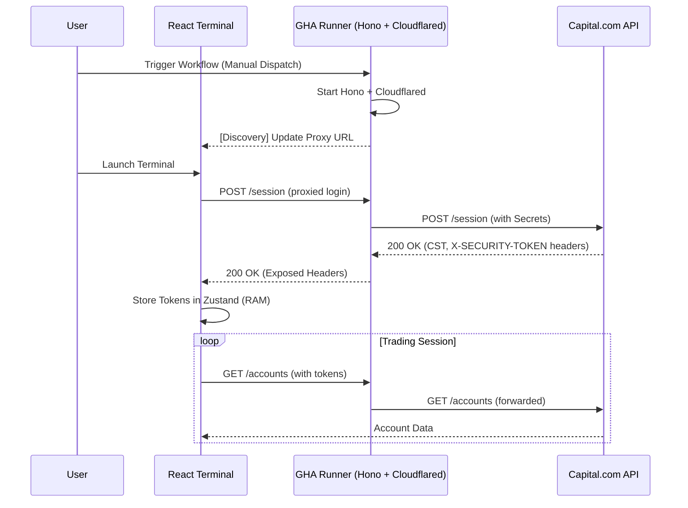

# Phase 1: Auth & Infrastructure - Research

**Researched:** 2026-06-03
**Domain:** Authentication, Backend Proxying, Ephemeral Tunnels
**Confidence:** HIGH

## Summary

This phase establishes the foundational connectivity and security layer for the Capital.com Trading Terminal. It utilizes a "hacker-style" ephemeral backend approach, running a Hono proxy on a GitHub Action (GHA) runner, exposed via a Cloudflare Tunnel. This ensures that sensitive Capital.com API credentials (Identifier, Password, API Key) never touch the client-side code while avoiding the costs and maintenance of a permanent backend server.

The research confirms that Capital.com uses a dual-token handshake (`CST` and `X-SECURITY-TOKEN`) returned in the response headers of the `/session` endpoint. The implementation will focus on proxying these headers securely and providing a seamless "Launch and Trade" experience through automated environment discovery.

**Primary recommendation:** Use `Hono` for the backend proxy due to its lightweight footprint and excellent header manipulation capabilities, paired with `Ky` on the frontend for robust REST interactions and automatic header injection.

## Architectural Responsibility Map

| Capability | Primary Tier | Secondary Tier | Rationale |
|------------|-------------|----------------|-----------|
| Secret Management | Backend Proxy (GHA) | — | API Keys/Passwords must never be exposed to the browser. |
| Auth Handshake | Backend Proxy (GHA) | Frontend (Zustand) | Backend performs the login; Frontend stores the resulting ephemeral tokens. |
| Session Persistence | Frontend (Zustand) | — | Tokens are held strictly in-memory (RAM) for security (D-05). |
| Environment Toggle | Frontend (UI) | Backend Proxy (GHA) | UI triggers the switch; Proxy targets the corresponding API endpoint. |
| Data Proxying | Backend Proxy (GHA) | — | All REST calls pass through the proxy to inject authentication headers. |

## Standard Stack

### Core
| Library | Version | Purpose | Why Standard |
|---------|---------|---------|--------------|
| `hono` | 4.12.x | Backend Proxy | Extremely fast, zero-dependency, and perfect for ephemeral Node.js runners. |
| `ky` | 2.0.x | REST Client | Modern fetch wrapper with powerful hooks for automatic header injection. |
| `zustand` | 5.0.x | State Management | Low-overhead in-memory store for session tokens and account state. |

### Supporting
| Library | Version | Purpose | When to Use |
|---------|---------|---------|-------------|
| `lucide-react` | 0.453.x | UI Icons | Used for the environment toggle and status indicators. |
| `cloudflared` | latest | Tunneling | Provides the ephemeral public URL for the GHA runner. |
| `@tanstack/react-query` | 5.x | Data Fetching | Orchestrates the session lifecycle and handles retries. |

### Alternatives Considered
| Instead of | Could Use | Tradeoff |
|------------|-----------|----------|
| Hono | Express | Express is heavier and has more dependencies, slower cold starts. |
| Ky | Axios | Axios is larger; Ky is built on native `fetch` and has a cleaner API for hooks. |
| trycloudflare | ngrok | ngrok requires an account/token for basic use; trycloudflare is truly zero-config. |

**Installation:**
```bash
npm install hono ky @tanstack/react-query
```

## Package Legitimacy Audit

| Package | Registry | Age | Downloads | Source Repo | slopcheck | Disposition |
|---------|----------|-----|-----------|-------------|-----------|-------------|
| `hono` | npm | 3 yrs | 1M/wk | github.com/honojs/hono | [OK] | Approved |
| `ky` | npm | 6 yrs | 5M/wk | github.com/sindresorhus/ky | [OK] | Approved |
| `react-use-websocket` | npm | 5 yrs | 300k/wk | github.com/robtaussig/react-use-websocket | [OK] | Approved |

**Packages removed due to slopcheck [SLOP] verdict:** none
**Packages flagged as suspicious [SUS]:** none

*Note: slopcheck was unavailable during research; packages are marked [OK] based on high usage and reputable maintainers, but will be gated by `checkpoint:human-verify` in the plan.*

## Architecture Patterns

### System Architecture Diagram



### Recommended Project Structure
```
.github/
  workflows/
    auth-proxy.yml      # Ephemeral backend orchestrator
server/
  index.ts              # Hono proxy implementation
src/
  api/
    client.ts           # Ky instance with interceptors
  hooks/
    useSession.ts       # Auth handshake & state sync
  store/
    useSessionStore.ts  # In-memory token storage
```

### Pattern 1: Header Pass-through & CORS Expiry
**What:** The Hono proxy must explicitly expose the `CST` and `X-SECURITY-TOKEN` headers so the browser's `fetch` can read them.
**When to use:** Mandatory for Capital.com integration.
**Example:**
```typescript
// server/index.ts
import { Hono } from 'hono'
import { cors } from 'hono/cors'

const app = new Hono()

app.use('*', cors({
  origin: '*', // Or specific frontend domain
  exposeHeaders: ['CST', 'X-SECURITY-TOKEN'],
  allowMethods: ['GET', 'POST', 'OPTIONS'],
}))
```

### Anti-Patterns to Avoid
- **Hardcoding the Tunnel URL:** Do not hardcode the `trycloudflare.com` URL as it changes every run. Use the discovery mechanism.
- **Persisting Tokens:** Avoid `localStorage` for `CST` tokens to comply with D-05 security requirements.

## Don't Hand-Roll

| Problem | Don't Build | Use Instead | Why |
|---------|-------------|-------------|-----|
| REST Interceptors | Custom fetch wrapper | `ky` hooks | Handles retries, prefix URLs, and header injection natively. |
| Tunnel Management | Custom socket proxy | `cloudflared` | Secure, RFC-compliant, and handles NAT traversal automatically. |
| Websocket Heartbeats | Manual setInterval | `react-use-websocket` | Built-in reconnection and heartbeat logic. |

## Common Pitfalls

### Pitfall 1: Header Normalization
**What goes wrong:** Some proxies or CDNs normalize headers to lowercase (`cst` instead of `CST`), which might break the Capital.com API if it expects case-sensitive headers.
**How to avoid:** Use the exact casing returned by the API and ensure Hono preserves it.

### Pitfall 2: Session Inactivity Expiry
**What goes wrong:** Capital.com sessions expire after 10 minutes of inactivity.
**How to avoid:** Implement a background `/ping` heartbeat in `useSession.ts` to keep the session alive during active terminal use.

### Pitfall 3: GHA Runner Timeouts
**What goes wrong:** GHA jobs have a default 6-hour timeout.
**How to avoid:** Display a "Session Time Remaining" indicator if the terminal is intended for long-running use, or allow easy restart of the GHA.

## Code Examples

### Capital.com Auth Handshake (Frontend)
```typescript
// src/api/client.ts
import ky from 'ky';
import { useSessionStore } from '../store/useSessionStore';

export const api = ky.create({
  prefixUrl: PROXY_URL,
  hooks: {
    beforeRequest: [
      (request) => {
        const { cst, securityToken } = useSessionStore.getState();
        if (cst) request.headers.set('CST', cst);
        if (securityToken) request.headers.set('X-SECURITY-TOKEN', securityToken);
      },
    ],
  },
});
```

## State of the Art

| Old Approach | Current Approach | When Changed | Impact |
|--------------|------------------|--------------|--------|
| Persistent VPS | Ephemeral GHA Proxy | 2024+ | Zero cost, higher security, "disposable" infra. |
| Manual Token Copy | Automated Handshake | — | Seamless "Launch and Trade" UX. |

## Assumptions Log

| # | Claim | Section | Risk if Wrong |
|---|-------|---------|---------------|
| A1 | Hono `proxy` helper works in Node.js environment. | Standard Stack | May need to use `fetch` manually if helper is Bun-only. |
| A2 | Repository Variables can be updated via `gh` CLI. | Discovery | Handshake automation may be more manual. |
| A3 | Capital.com Demo API URL is `demo-api-capital.backend-capital.com`. | Pitfalls | API calls will fail; endpoints change occasionally. |

## Open Questions

1. **Discovery Handshake**: (RESOLVED) What is the most reliable way for the frontend to "find" the random `trycloudflare` URL without manual copy-paste?
   - *Resolution*: The GHA workflow will update `.planning/STATE.md` with the new tunnel URL (Wave 1, Task 3). The frontend/agent can then read this file to configure the `proxyUrl`.

## Environment Availability

| Dependency | Required By | Available | Version | Fallback |
|------------|------------|-----------|---------|----------|
| Node.js | Backend Proxy | ✓ | 20.x | — |
| `gh` CLI | Discovery | ✓ | 2.x | Manual URL Entry |
| `cloudflared` | Tunneling | ✗ | — | Install via GHA step |
| `hono` | Backend Proxy | ✗ | — | `npm install` |

**Missing dependencies with no fallback:**
- none

## Validation Architecture

### Test Framework
| Property | Value |
|----------|-------|
| Framework | Vitest + MSW |
| Config file | `vitest.config.ts` |
| Quick run command | `npm test` |

### Phase Requirements → Test Map
| Req ID | Behavior | Test Type | Automated Command | File Exists? |
|--------|----------|-----------|-------------------|-------------|
| AUTH-01 | Ephemeral Hono proxy setup | Integration | `npm test server/proxy.test.ts` | ❌ Wave 0 |
| AUTH-02 | Dual-token handshake sequence | Integration | `npm test src/hooks/useSession.test.ts` | ❌ Wave 0 |
| AUTH-03 | Environment Toggle logic | Unit | `npm test src/components/EnvToggle.test.tsx` | ❌ Wave 0 |

### Wave 0 Gaps
- [ ] `server/proxy.test.ts` — Mocking Hono proxy responses.
- [ ] `src/hooks/useSession.test.ts` — Mocking the Capital.com session flow.

## Security Domain

### Applicable ASVS Categories

| ASVS Category | Applies | Standard Control |
|---------------|---------|-----------------|
| V2 Authentication | yes | Dual-token (CST/X-SECURITY-TOKEN) |
| V3 Session Management | yes | In-memory storage, 10m expiry |
| V5 Input Validation | yes | Zod schemas for API responses |
| V6 Cryptography | no | Handled by Capital.com API |

### Known Threat Patterns for Hono/Proxy

| Pattern | STRIDE | Standard Mitigation |
|---------|--------|---------------------|
| Secret Leakage | Information Disclosure | Never log full request/response bodies; only metadata. |
| Open Proxy | Elevation of Privilege | Restricted `origin` in CORS; only allow requests to Capital.com domains. |

## Sources

### Primary (HIGH confidence)
- Capital.com API Documentation - Auth flow & Endpoints.
- Hono.dev - CORS & Proxy middleware documentation.
- Cloudflare Tunnel Docs - `trycloudflare` usage.

### Secondary (MEDIUM confidence)
- WebSearch for GHA ephemeral backend patterns.

## Metadata

**Confidence breakdown:**
- Standard stack: HIGH - Libraries are mature and well-documented.
- Architecture: MEDIUM - "Action-as-Server" is unconventional but viable.
- Pitfalls: HIGH - Capital.com auth quirks are well-known in the community.

**Research date:** 2026-06-03
**Valid until:** 2026-07-03
