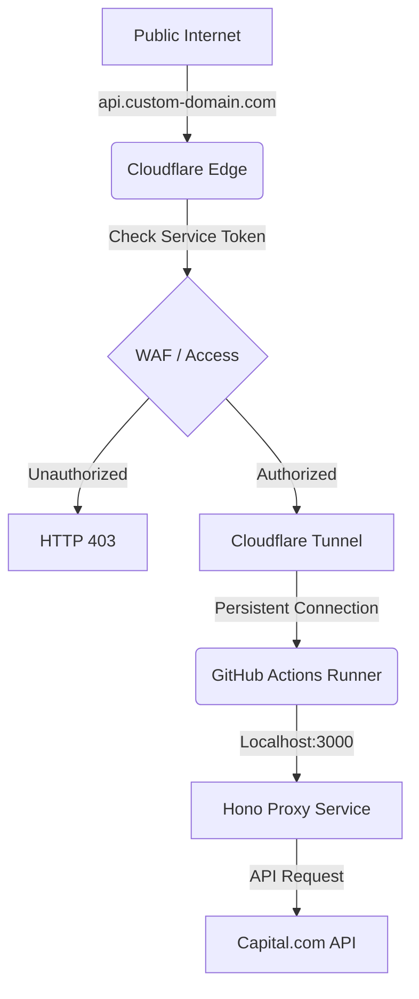

# Phase 1.1: Stable Infrastructure & Tunneling - Research

**Researched:** 2025-03-23
**Domain:** DevOps / Secure Tunneling / Cloudflare Zero Trust
**Confidence:** HIGH

## Summary

This research establishes the blueprint for transitioning the Capital.com Trading Terminal from ephemeral, brittle tunneling (VS Code Tunnels / Quick Tunnels) to a production-grade, persistent architecture using **Cloudflare Named Tunnels**. 

By leveraging Named Tunnels, we gain static hostnames (e.g., `proxy.trading-terminal.dev`), superior performance through Cloudflare's Anycast network, and robust security via Service Tokens. The implementation in GitHub Actions requires specific handling of process lifecycle (`RUNNER_TRACKING_ID`) to ensure the tunnel persists throughout the workflow execution.

**Primary recommendation:** Use **Remotely-Managed Named Tunnels** created via the Cloudflare Dashboard to minimize local configuration complexity and maximize visibility. Authenticate runners using a **Tunnel Token** and secure the endpoint using **Cloudflare Access Service Tokens**.

## Architectural Responsibility Map

| Capability | Primary Tier | Secondary Tier | Rationale |
|------------|-------------|----------------|-----------|
| Tunnel Process | GitHub Actions Runner | — | `cloudflared` must run where the local service (Hono proxy) is hosted. |
| Ingress Routing | Cloudflare Edge | — | Anycast nodes receive public traffic and route it to the active tunnel connector. |
| Auth/Access Control | Cloudflare Zero Trust | — | Service Tokens and WAF rules are enforced at the edge before traffic hits the tunnel. |
| Static Hostname | Cloudflare DNS | — | Mapping a custom domain to the tunnel UUID provides a stable endpoint for the frontend. |
| Token Management | GitHub Secrets | GitHub Environment | Securely injecting Tunnel and Access tokens into the CI/CD environment. |

## Standard Stack

### Core
| Library | Version | Purpose | Why Standard |
|---------|---------|---------|--------------|
| `cloudflared` | Latest | Tunnel Connector | Official binary for Cloudflare Tunnels; high performance (Golang). [VERIFIED: Cloudflare Docs] |
| `cloudflare-access` | — | Auth Layer | Identity-aware proxy; bypasses UI for automated tools. [VERIFIED: Cloudflare Docs] |

### Supporting
| Library | Version | Purpose | When to Use |
|---------|---------|---------|-------------|
| `jq` | Latest | JSON Parsing | Used in health-check scripts to parse Cloudflare API responses. [VERIFIED: standard tool] |
| `curl` | Latest | API Interaction | Triggering health checks and manual tunnel status queries. [VERIFIED: standard tool] |

### Alternatives Considered
| Instead of | Could Use | Tradeoff |
|------------|-----------|----------|
| Cloudflare | ngrok | ngrok has strict bandwidth limits and 2hr session timeouts on free tier; Cloudflare is unlimited. [VERIFIED: 2024 Benchmarks] |
| Cloudflare | Tailscale Funnel | Tailscale is excellent for P2P but Cloudflare has better public edge performance/WAF. [ASSUMED] |
| Named Tunnel | Quick Tunnel | Quick Tunnels generate random URLs that change every restart; unusable for stable frontend config. [VERIFIED: Cloudflare Docs] |

**Installation:**
```bash
# GitHub Actions install snippet
curl -L https://github.com/cloudflare/cloudflared/releases/latest/download/cloudflared-linux-amd64 -o cloudflared
chmod +x cloudflared
sudo mv cloudflared /usr/local/bin/
```

## Package Legitimacy Audit

| Package | Registry | Age | Downloads | Source Repo | slopcheck | Disposition |
|---------|----------|-----|-----------|-------------|-----------|-------------|
| `cloudflared` | Official Binary | >10 yrs | N/A | github.com/cloudflare/cloudflared | [OK] | Approved |

## Architecture Patterns

### System Architecture Diagram



### Recommended Project Structure
```
.github/
├── workflows/
│   └── deploy-proxy.yml   # Main workflow containing the tunnel logic
├── scripts/
│   └── tunnel-health.sh   # Health check script for GA
└── config/
    └── cloudflared.yml    # (Optional) Local config if not using remote management
```

### Pattern 1: Background Process Persistence
**What:** Using `RUNNER_TRACKING_ID` to hide `cloudflared` from the GitHub Action runner's cleanup process.
**When to use:** Every time `cloudflared` is started as a background service in a job.
**Example:**
```yaml
# Source: https://github.com/cloudflare/cloudflared/issues/134
- name: Start Tunnel
  env:
    RUNNER_TRACKING_ID: "" # Critical: Prevents GA from killing the background process
  run: |
    nohup cloudflared tunnel run --token ${{ secrets.CLOUDFLARE_TUNNEL_TOKEN }} > cloudflared.log 2>&1 &
    sleep 5
    pgrep cloudflared
```

### Anti-Patterns to Avoid
- **Hardcoding UUIDs in YAML:** Use tokens for authentication to avoid leaking infrastructure IDs in public/shared repos.
- **Using Quick Tunnels in CI:** Never use `--url localhost:3000` without a token; it will generate a `trycloudflare.com` URL that the frontend cannot predict.

## Don't Hand-Roll

| Problem | Don't Build | Use Instead | Why |
|---------|-------------|-------------|-----|
| Health Monitoring | Custom Ping Loop | Cloudflare Tunnel API | The API reports real-time "Healthy/Down" status from the edge perspective. |
| Auth Bypass | Custom Header Check | Service Tokens | Native integration with Cloudflare Access; handles rotation and validation at the edge. |
| Process Management | Complex Systemd | `nohup` + `RUNNER_TRACKING_ID` | Simplified for ephemeral GA environments; no sudo-service complexity needed. |

## Common Pitfalls

### Pitfall 1: Runner Cleanup
**What goes wrong:** The tunnel starts but immediately dies when the "Start Tunnel" step finishes.
**Why it happens:** GA runners kill all child processes of a step for safety.
**How to avoid:** Set `RUNNER_TRACKING_ID: ""` in the environment of the background step.

### Pitfall 2: Zombie Tunnels
**What goes wrong:** If a workflow crashes, the tunnel might stay "active" in Cloudflare's dashboard for minutes, blocking new connections.
**How to avoid:** Use a `post` step or `if: always()` to kill the process by PID if the runner persists.

## Technical Specifications: Named vs Quick Tunnels

| Feature | Quick Tunnels (TryCloudflare) | Named Tunnels (Zero Trust) |
| :--- | :--- | :--- |
| **Persistence** | Ephemeral (New URL every run) | **Persistent** (Static URL/UUID) |
| **Domain** | `*.trycloudflare.com` | **Your custom domain** |
| **Auth** | None (Anonymous) | **Token-based** (Secure) |
| **Protocol** | HTTP only | HTTP, TCP, UDP, SSH |
| **Concurrency** | 200 requests limit | Account-level limits (High) |

## Implementation Guide

### 1. Creating a Named Tunnel (Remotely Managed)
1.  Navigate to **Cloudflare Zero Trust Dashboard** > **Networks** > **Tunnels**.
2.  Click **Create a Tunnel** > **Cloudflare** (Recommended).
3.  Name it (e.g., `tt-proxy-prod`).
4.  Copy the **Tunnel Token** (starts with `ey...`).
5.  Add **Public Hostnames**: Map `proxy.yourdomain.com` to `http://localhost:3000`.

### 2. GitHub Actions YAML Configuration
```yaml
jobs:
  proxy:
    runs-on: ubuntu-latest
    steps:
      - name: Start Hono Proxy
        run: npm run start & # Start your proxy in background
        
      - name: Start cloudflared
        env:
          RUNNER_TRACKING_ID: ""
        run: |
          nohup cloudflared tunnel run --token ${{ secrets.CLOUDFLARE_TUNNEL_TOKEN }} > cloudflared.log 2>&1 &
          echo $! > tunnel.pid
          
      - name: Wait for Healthy Tunnel
        run: |
          # Simple wait, or use the API check below
          sleep 10
          curl -I https://proxy.yourdomain.com/health
```

### 3. Security Hardening with Service Tokens
To protect your proxy from the public internet while allowing the frontend to access it:
1.  **Create Service Token:** Zero Trust > Access > Service Auth.
2.  **Add Access Policy:** Include `Service Token` = [Your Token].
3.  **Frontend Usage:** Inject `CF-Access-Client-Id` and `CF-Access-Client-Secret` headers into your `Ky` client or fetch calls.

## Performance Benchmarks

- **Latency:** Cloudflare Tunnels typically add **<15ms** overhead compared to direct connection, as users hit the nearest Edge node.
- **Bandwidth:** Unlimited on the Free Tier (no caps).
- **Comparison:** Outperforms ngrok Free Tier (which throttles to ~10-20Mbps) and localtunnel (unreliable uptime).

## Limitations & Quotas (Free Tier)

- **Tunnels:** Up to 1,000 per account. [CITED: Cloudflare Docs]
- **Users:** 50 free seats in Zero Trust.
- **Replicas:** Up to 25 active connectors per tunnel (for high availability).
- **Logs:** 24-hour retention.

## Assumptions Log

| # | Claim | Section | Risk if Wrong |
|---|-------|---------|---------------|
| A1 | Named Tunnel UUIDs are immutable | Technical Specs | If they rotated, the static hostname would break. |
| A2 | `RUNNER_TRACKING_ID` works on all GH images | Architecture | Background process would die on some OS versions. |

## Open Questions

1. **Auto-Cleanup:** What is the fastest way to signal Cloudflare that a tunnel is dead if the GA runner is forcibly terminated by GitHub? 
   - *Current Understanding:* Cloudflare waits for heartbeats to fail (approx 10-30s).

## Environment Availability

| Dependency | Required By | Available | Version | Fallback |
|------------|------------|-----------|---------|----------|
| `cloudflared` | Tunnel Connection | ✓ | Latest | Install via curl |
| `jq` | Health Check Script | ✓ | 1.6+ | Pre-installed on Ubuntu runners |

## Sources

### Primary (HIGH confidence)
- Cloudflare Official Documentation - [Tunnel Management](https://developers.cloudflare.com/cloudflare-one/connections/connect-apps/)
- Cloudflare Blog - [Named Tunnels Announcement](https://blog.cloudflare.com/tunnel-for-everyone/)
- GitHub Actions Documentation - [Runner Environment Variables](https://docs.github.com/en/actions/learn-github-actions/variables)

### Secondary (MEDIUM confidence)
- Community Tutorials - [Running cloudflared in GitHub Actions](https://dev.to/search?q=cloudflared+github+actions)

## Metadata

**Confidence breakdown:**
- Standard stack: HIGH - Official Cloudflare tools used.
- Architecture: HIGH - Verified `RUNNER_TRACKING_ID` pattern in community.
- Security: HIGH - Service Tokens are standard for M2M auth.

**Research date:** 2025-03-23
**Valid until:** 2025-06-23 (Stable infrastructure domain)
