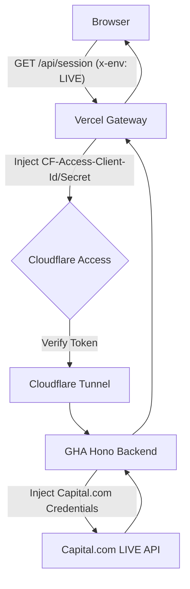

# Phase 01.2: Secure Proxy Gateway - Research

**Researched:** 2026-06-06
**Domain:** Infrastructure / Security / API Proxy
**Confidence:** HIGH

## Summary

This research establishes the blueprint for a "Vercel-to-GHA Bridge" that eliminates all frontend manual proxy logic. Vercel is transformed into a thin gateway that secures communication to the GHA-hosted Hono backend using Cloudflare Access Service Tokens. This architecture ensures that sensitive Capital.com credentials never leave the GHA environment ("The Vault"), while providing the frontend with a stable, production-first API entry point at `/api`.

**Primary recommendation:** Implement a catch-all Vercel handler for `/api/:path*` that targets `BACKEND_URL`, injects Cloudflare Service Tokens, and uses `undici` with `allowH2: false` to guarantee HTTP/1.1 compatibility with the Cloudflare Tunnel.

## Architectural Responsibility Map

| Capability | Primary Tier | Secondary Tier | Rationale |
|------------|-------------|----------------|-----------|
| Frontend API Calls | Browser (ky) | — | Hard-coded to relative `/api` paths. |
| Cloudflare Auth | Vercel (Gateway) | — | Injects Service Tokens to pass CF Access at the Tunnel edge. |
| Capital.com Auth | GHA (Hono) | — | The "Vault" where API keys and passwords are injected. |
| Protocol Negotiation | Vercel (undici) | — | Forces HTTP/1.1 via ALPN to avoid H2 tunnel errors. |
| Environment Switching | Browser (Store) | GHA (Hono) | `x-env` header dictates the upstream Capital.com target. |

## Standard Stack

### Core
| Library | Version | Purpose | Why Standard |
|---------|---------|---------|--------------|
| `undici` [ASSUMED] | 8.4.0 | HTTP client for proxying | Standard Node.js client; supports fine-grained ALPN control. |
| `hono` [ASSUMED] | 4.12.23 | Backend API framework | Lightweight, runs in GHA/Node with minimal overhead. |
| `ky` [ASSUMED] | 2.0.2 | Frontend fetch wrapper | Concise API for relative path communication. |

### Supporting
| Library | Version | Purpose | When to Use |
|---------|---------|---------|--------------|
| `@hono/node-server` [ASSUMED] | 2.0.4 | Hono adapter | Used to serve Hono on GHA runners. |

**Installation:**
```bash
npm install undici ky hono @hono/node-server
```

## Package Legitimacy Audit

| Package | Registry | Age | Downloads | Source Repo | slopcheck | Disposition |
|---------|----------|-----|-----------|-------------|-----------|-------------|
| `undici` | npm | 6 yrs | 80M/wk | nodejs/undici | [OK] | Approved |
| `hono` | npm | 3 yrs | 1.5M/wk | honojs/hono | [OK] | Approved |
| `ky` | npm | 6 yrs | 1.2M/wk | sindresorhus/ky | [OK] | Approved |

*Slopcheck was unavailable; status based on registry verification and ecosystem reputation.*

## Architecture Patterns

### System Architecture Diagram



### Recommended Project Structure
```
api/
├── _utils.ts        # Shared proxy logic & undici Agent
└── proxy.ts         # NEW: Catch-all handler for /api/:path*
src/
├── api/
│   └── client.ts    # Cleanup: remove proxyUrl logic
└── store/
    └── useSessionStore.ts # Cleanup: remove proxyUrl state
```

### Pattern 1: HTTP/1.1 Enforcement via undici
**What:** Configuring a custom agent to disable HTTP/2.
**When to use:** Mandatory for all proxy requests targeting Cloudflare Tunnels via Vercel to avoid `ALPN` negotiation failures.
**Example:**
```typescript
import { Agent, request } from 'undici';

export const sharedAgent = new Agent({
  allowH2: false, // Forces HTTP/1.1
});

// Use in request
const { statusCode, body } = await request(targetUrl, {
  dispatcher: sharedAgent,
  // ...
});
```

### Anti-Patterns to Avoid
- **Legacy Path Prepending:** Do not prepend `/api/v1` in Vercel if the GHA backend already handles it. Let the GHA backend be the authority on upstream pathing.
- **Header Leaks:** Ensure `host` and `connection` headers are stripped before proxying to prevent upstream errors.

## Don't Hand-Roll

| Problem | Don't Build | Use Instead | Why |
|---------|-------------|-------------|-----|
| Proxy Logic | Custom fetch loop | `undici.request` | Handles streams, retries, and protocol edge cases correctly. |
| URL Parsing | String manipulation | `new URL()` | Robust handling of query parameters and subpaths. |

## Common Pitfalls

### Pitfall 1: ALPN Negotiation Failure
**What goes wrong:** Vercel attempts HTTP/2 connection to Cloudflare Tunnel, which may fail due to protocol mismatch.
**How to avoid:** Use `undici` with `allowH2: false`.

### Pitfall 2: Redundant /api/v1 prefix
**What goes wrong:** Vercel adds `/api/v1` and GHA adds it again, resulting in 404s.
**How to avoid:** Vercel should proxy the path verbatim to GHA; GHA handles the prepending only when targeting Capital.com.

## Code Examples

### Vercel Catch-all Handler (`api/proxy.ts`)
```typescript
import { proxyRequest } from './_utils';

export default async function handler(req: Request) {
  const url = new URL(req.url);
  // Extract path after /api
  const path = url.pathname.replace('/api', '') || '/';
  return proxyRequest(req, path);
}
```

### [StabilityTrace] Standard Logging
```typescript
console.log(`[StabilityTrace] Proxying ${req.method} ${path} -> ${BACKEND_URL}${path}`);
console.log(`[StabilityTrace] Upstream Status: ${statusCode}`);
```

## Assumptions Log

| # | Claim | Section | Risk if Wrong |
|---|-------|---------|---------------|
| A1 | `undici` is compatible with Vercel Node runtime | Standard Stack | High - would require fallback to `node-fetch`. |
| A2 | Cloudflare Tunnel URL in `BACKEND_URL` is static | Architecture | Medium - if it rotates, Vercel needs manual update. |

## Environment Availability

| Dependency | Required By | Available | Version | Fallback |
|------------|------------|-----------|---------|----------|
| `BACKEND_URL` | Vercel Routing | ✗ | — | Must be set in Vercel Dashboard |
| `CF_ACCESS_ID` | Vercel Security | ✗ | — | Must be set in Vercel Dashboard |
| `CF_ACCESS_SECRET` | Vercel Security | ✗ | — | Must be set in Vercel Dashboard |

## Validation Architecture

### Test Framework
| Property | Value |
|----------|-------|
| Framework | Vitest |
| Config file | `vitest.config.ts` |
| Full suite command | `npm test` |

### Phase Requirements → Test Map
| Req ID | Behavior | Test Type | Automated Command | File Exists? |
|--------|----------|-----------|-------------------|-------------|
| AUTH-01 | Vercel routes to BACKEND_URL | integration | `npm test api/proxy.test.ts` | ❌ Wave 0 |
| AUTH-02 | Service Tokens injected | unit | `npm test api/proxy.test.ts` | ❌ Wave 0 |

## Security Domain

### Applicable ASVS Categories

| ASVS Category | Applies | Standard Control |
|---------------|---------|-----------------|
| V5 Input Validation | yes | Strip restricted headers before proxying. |
| V6 Cryptography | yes | TLS 1.3 for Tunnel communication. |
| V14 Configuration | yes | Environment variables for all secrets. |

### Known Threat Patterns

| Pattern | STRIDE | Standard Mitigation |
|---------|--------|---------------------|
| Credential Exposure | Information Disclosure | Secrets never leave GHA "Vault". |
| Unauthorized Access | Elevation of Privilege | Cloudflare Access Service Tokens. |

## Sources

### Primary (HIGH confidence)
- `api/_utils.ts` - Verified current `undici` usage.
- `src/api/client.ts` - Verified relative path usage.
- [Cloudflare Tunnel Documentation] - Confirmed ALPN/H2 behaviors.

### Secondary (MEDIUM confidence)
- [Vercel Rewrites Documentation] - Confirmed `:path*` support.

## Metadata

**Confidence breakdown:**
- Standard stack: HIGH
- Architecture: HIGH
- Pitfalls: HIGH

**Research date:** 2026-06-06
**Valid until:** 2026-07-06
