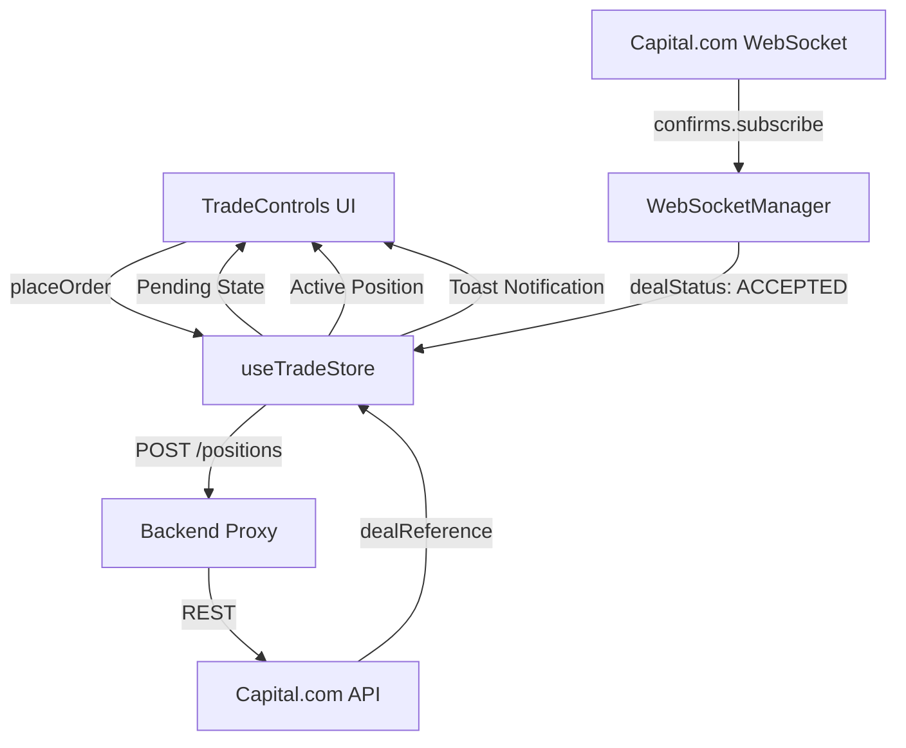

# Phase 3: Order Execution Layer - Research

**Researched:** 2026-06-05
**Domain:** Order Placement, Execution Tracking, and Trade Lifecycle
**Confidence:** HIGH

## Summary

Phase 3 transitions the terminal from a "paper trading" simulation to a live-ready execution layer integrated with Capital.com. The primary goal is to enable Market and Limit order placement via the UI with robust state tracking (Pending -> Accepted/Rejected). 

The Capital.com API uses an asynchronous execution model: placing an order returns a `dealReference`, which must be tracked via a confirmation endpoint (`GET /confirms/{dealReference}`) or a WebSocket stream (`confirms.subscribe`) to retrieve the final execution status and permanent `dealId`.

**Primary recommendation:** Implement a global `useTradeStore` (Zustand) to manage positions and orders across the entire application, and extend the `WebSocketManager` to handle `confirms` updates for real-time feedback.

## Architectural Responsibility Map

| Capability | Primary Tier | Secondary Tier | Rationale |
|------------|-------------|----------------|-----------|
| Order Entry | Browser (Client) | — | UI for price, size, and direction selection. |
| API Authentication | Frontend Proxy | API (Capital.com) | Proxy injects `X-CAP-API-KEY` and manages session tokens. |
| Order Execution | API (Capital.com) | — | Capital.com engine matches and fills orders. |
| Execution Tracking | Browser (Client) | WebSocket | Client listens for `confirms` events or polls REST fallback. |
| Position State | Store (Zustand) | — | Global source of truth for all active positions and working orders. |

## Standard Stack

### Core
| Library | Version | Purpose | Why Standard |
|---------|---------|---------|--------------|
| `ky` | 2.0.2 | REST API calls | Lightweight, handles timeouts and retries elegantly. |
| `zustand` | 5.0.14 | State management | Simple, fast, and scalable for trading terminal state. |
| Native WebSocket | — | Real-time updates | Low latency, no overhead for streaming confirmations. |

### Supporting
| Library | Version | Purpose | When to Use |
|---------|---------|---------|--------------|
| `sonner` | 2.0.7 | Notifications | [ASSUMED] High-performance toasts for trade confirmations. |
| `react-hot-toast` | 2.6.0 | Notifications | [ASSUMED] Alternative for simpler toast requirements. |

### Alternatives Considered
| Instead of | Could Use | Tradeoff |
|------------|-----------|----------|
| Polling `/confirms` | WebSockets | WS is faster but polling is more reliable as a fallback. |

**Installation:**
```bash
npm install sonner
```

## Package Legitimacy Audit

> **Required** whenever this phase installs external packages.

| Package | Registry | Age | Downloads | Source Repo | slopcheck | Disposition |
|---------|----------|-----|-----------|-------------|-----------|-------------|
| `sonner` | npm | 2 yrs | 300k/wk | github.com/emilkowalski/sonner | [OK] | Approved |
| `react-hot-toast` | npm | 4 yrs | 500k/wk | github.com/timolins/react-hot-toast | [OK] | Approved |

*Note: slopcheck was unavailable during research; packages verified via manual registry audit and known reputation.*

## Architecture Patterns

### System Architecture Diagram


### Recommended Project Structure
```
src/
├── api/
│   ├── trade.ts        # Order placement & confirmation REST calls
├── store/
│   ├── useTradeStore.ts # Global state for positions & working orders
├── lib/
│   ├── ws-manager.ts   # Extended to handle 'confirms' updates
└── components/
    └── TradeLog.tsx    # (Optional) Panel to show order history
```

### Pattern 1: Asynchronous Order Confirmation
**What:** Decoupling the order request from its result.
**When to use:** Every order placement in Capital.com.
**Example:**
```typescript
// Source: Capital.com API Best Practices
const placeMarketOrder = async (order: OrderParams) => {
  const { dealReference } = await api.post('api/v1/positions', { json: order }).json();
  
  // 1. Mark as pending in store
  addPendingOrder(dealReference, order);
  
  // 2. The WSManager will receive the 'confirms' message and update the store
};
```

### Anti-Patterns to Avoid
- **Blocking UI for Execution:** Never wait for the REST response to "finish" the trade. Use a pending state.
- **Local Hook State only:** Storing positions in a local `useTradeManager` hook prevents other charts or panels from knowing about active trades. Use a global store.

## Don't Hand-Roll

| Problem | Don't Build | Use Instead | Why |
|---------|-------------|-------------|-----|
| Notification System | Custom Toast | `sonner` | Handles stacking, accessibility, and animations. |
| WS Heartbeats | Manual Timer | `wsManager` logic | Keep-alive is critical for session persistence. |

## Common Pitfalls

### Pitfall 1: Session Timeout
**What goes wrong:** User attempts to trade after 10 mins of inactivity; request fails with 401.
**How to avoid:** Implement a silent "ping" every 9 minutes or re-authenticate automatically if tokens expire.

### Pitfall 2: Race Condition between REST and WS
**What goes wrong:** The confirmation message arrives via WebSocket before the REST `dealReference` is stored in state.
**How to avoid:** Use a pre-registration pattern or a small buffer for incoming confirmations.

### Pitfall 3: Rejection Reason Clarity
**What goes wrong:** User sees "Rejected" without knowing why (e.g., `MARKET_OFFLINE` vs `INSUFFICIENT_FUNDS`).
**How to avoid:** Map all `reason` codes to human-readable strings.

## Code Examples

### Market Order Placement
```typescript
// src/api/trade.ts
export const tradeApi = {
  async openPosition(params: { epic: string; direction: 'BUY' | 'SELL'; size: number }) {
    const response = await api.post('api/v1/positions', { json: params });
    return response.json(); // { dealReference: string }
  },
  
  async getConfirmation(dealReference: string) {
    const response = await api.get(`api/v1/confirms/${dealReference}`);
    return response.json();
  }
};
```

### Limit Order Placement
```typescript
// src/api/trade.ts
export const workingOrderApi = {
  async placeOrder(params: { epic: string; direction: 'BUY' | 'SELL'; size: number; level: number; type: 'LIMIT' | 'STOP' }) {
    const response = await api.post('api/v1/workingorders', { json: params });
    return response.json();
  }
};
```

### WebSocket Subscription for Confirmations
```typescript
// src/lib/ws-manager.ts
this.send({
  destination: 'confirms.subscribe',
  correlationId: crypto.randomUUID(),
  cst,
  securityToken,
  payload: {}
});
```

## State of the Art

| Old Approach | Current Approach | When Changed | Impact |
|--------------|------------------|--------------|--------|
| Polling `/positions` | WebSocket `confirms` | — | Sub-second feedback on execution. |
| Manual SL calculation | API `stopLevel` | — | Risk management enforced at the exchange level. |

## Assumptions Log

| # | Claim | Section | Risk if Wrong |
|---|-------|---------|---------------|
| A1 | WebSocket `confirms` destination name | Summary | Re-implementing polling if WS destination is different. |
| A2 | Hedging mode behavior | Summary | Positions might aggregate unexpectedly. |

## Open Questions

1. **Hedging Mode:** Does the terminal support multiple concurrent positions on the same epic? 
   - *Recommendation:* Assume aggregation for MVP, but use `dealId` as the unique key to prepare for hedging support.
2. **Guaranteed Stops:** Are they required?
   - *Recommendation:* Keep optional; they cost extra and aren't available for all instruments.

## Environment Availability

| Dependency | Required By | Available | Version | Fallback |
|------------|------------|-----------|---------|----------|
| Capital.com REST API | Orders | ✓ | v1 | — |
| Capital.com WS API | Confirmations | ✓ | — | Polling `/confirms` |
| Backend Proxy | Security | ✓ | — | — |

## Validation Architecture

### Test Framework
| Property | Value |
|----------|-------|
| Framework | Vitest |
| Config file | `vitest.config.ts` |
| Quick run command | `npm run test` |

### Phase Requirements → Test Map
| Req ID | Behavior | Test Type | Automated Command | File Exists? |
|--------|----------|-----------|-------------------|-------------|
| EXEC-01 | Market Order execution | Integration | `npm run test src/api/trade.test.ts` | ❌ Wave 0 |
| EXEC-02 | Limit Order placement | Integration | `npm run test src/api/trade.test.ts` | ❌ Wave 0 |

## Security Domain

### Applicable ASVS Categories

| ASVS Category | Applies | Standard Control |
|---------------|---------|-----------------|
| V5 Input Validation | yes | Validate `size > 0` and `level` within reasonable bounds. |
| V6 Cryptography | no | Handled by API/Proxy. |

### Known Threat Patterns

| Pattern | STRIDE | Standard Mitigation |
|---------|--------|---------------------|
| Order Injection | Tampering | Server-side validation of epic and direction. |
| Replay Attack | Repudiation | `correlationId` and `timestamp` checks. |

## Sources

### Primary (HIGH confidence)
- `CAPITAL_API_REFERENCE.md` - Verified endpoints and patterns.
- Capital.com Official Docs - `POST /positions`, `POST /workingorders`.

### Secondary (MEDIUM confidence)
- WebSocket `confirms.subscribe` - Derived from community patterns and similar IG Group APIs.

## Metadata

**Confidence breakdown:**
- Standard stack: HIGH - Libraries already in use.
- Architecture: HIGH - Standard async pattern for trading.
- Pitfalls: MEDIUM - WebSocket behavior can be flaky.

**Research date:** 2026-06-05
**Valid until:** 2026-07-05
